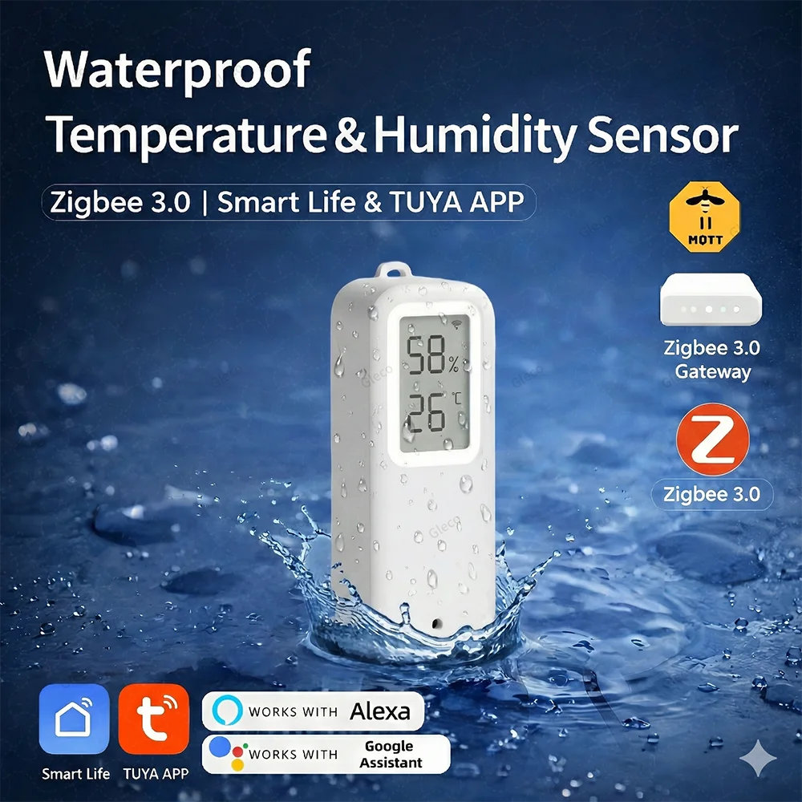
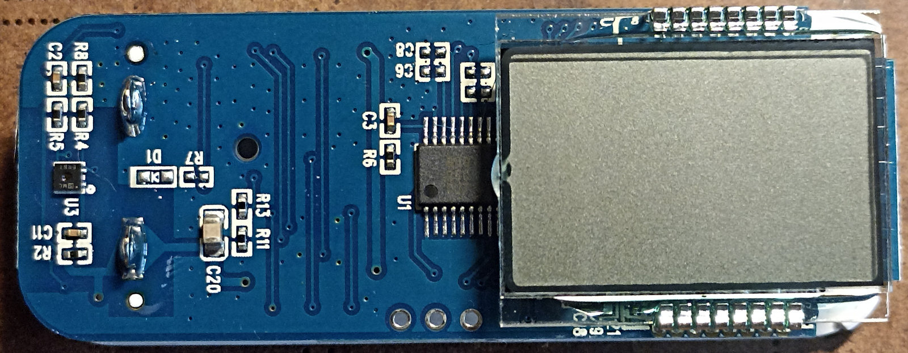
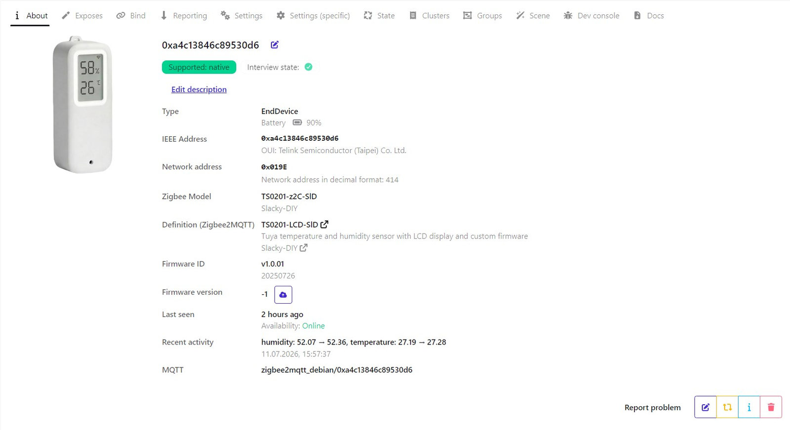
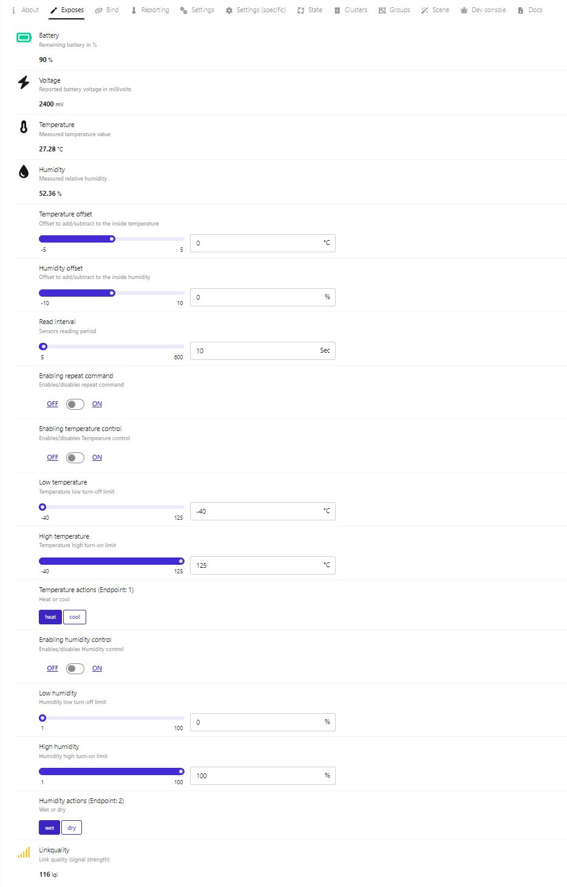
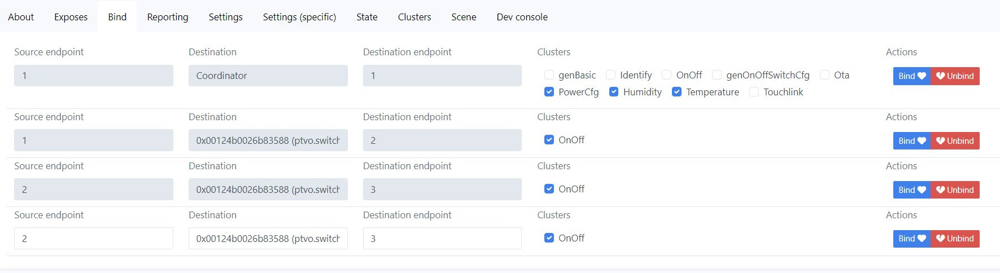
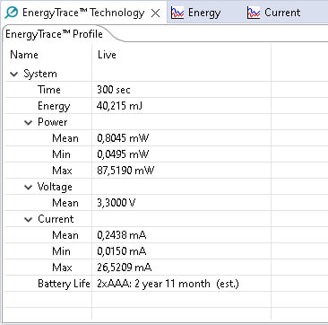
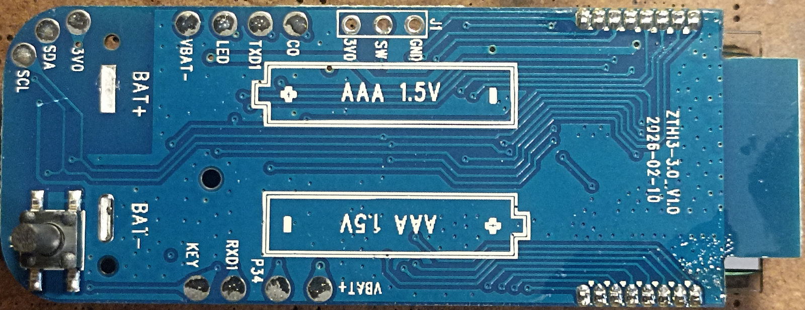

# <a id="Top">Tuya Temperature and Relative Humidity Sensor Zigbee with custom firmware</a>

Альтернативные версии на различные датчики `Zigbee` можно еще посмотреть у [pvvx](https://github.com/pvvx/ZigbeeTLc).

### Custom firmware for Tuya sensor models

- TS0201 Wing

**Автор не несет никакой ответственности, если вы, воспользовавшись этим проектом, превратите свой умный датчик в полоумный.**

Если у вас другая сигнатура, лучше не заливать, не проверив на совпадение сенсора и GPIO.

Проверялся в zigbee2mqtt (пока требуется [внешний конвертор](doc/external_converters/ts0201_lcd_sld_zigbee2mqtt.js)).

---

## Возмножности

**About**

**Exposes**

- **Battery** - емкость батарейки в %.
- **Voltage** - напряжение батарейки в mV.
- **Temperature** - диапозон от -40 до +125 °C.
- **Humidity** - диапазон от 0 до 100 %.
- **Temperature offset** - калибровка температуры от -5 до +5 °C с шагом 0,1.
- **Humidity offset** - калибровка влажности от -10 до + 10 % с шагом 1.
- **Read interval** - интервал чтения сенсора. От 5 до 600 секунд с шагом 1. По умолчанию этот период задан в 10 секунд. Используется, если репортинг температуры или влажности установлен более 600 секунд. Эти параметры также влияют на то время, которое модуль "спит", т.е. находится в режиме экономии батареи. Время считывания сенсора берется из настроек репортинга, если он не превышает 600 секунд. Если превышает, то из `Read interval`.
- **Enabling repeat command** - активирование повторения команд при активации `Enabling temperature control` и (или) `Enabling humidity control`.
- **Enabling temperature control** - активирование управления удаленным устройством по температуре.
- **High temperature** - высокая граница температуры - при переходе этой границы в большую сторону будет послана команда на включение удаленного устройства.
- **Low temperature** - низкая граница температуры - при переходе этой границы в меньшую сторону будет послана команда на выключение удаленного устройства.
- **Enabling humidity control** - активирование управления удаленным устройством по влажности.
- **High humidity** - высокая граница влажности - при переходе этой границы в большую сторону будет послана команда на включение удаленного устройства.
- **Low humidity** - низкая граница влажности - при переходе этой границы в меньшую сторону будет послана команда на выключение удаленного устройства.
- **Temperature actions** - настраивает, какую именно команду мы шлем при управлении удаленным устройством по температуре. Если этот параметр установлен в `heat`, то при увеличении и достижении `High temperature` температуры высылается команда `off`, а при уменьшении и достижении `Low temperature` температуры высылается команда `on`. Таким образом мы получаем режим работы нагревателя. Если же параметр `Temperature actions` установлен в `cool`, то команды меняются местами. Таким образом мы получаем режим работы охладителя.
- **Humidity actions** - настраивает, какую именно команду мы шлем при управлении удаленным устройством по влажности. Если этот параметр установлен в `wet`, то при увеличении и достижении `High humidity` влажности высылается команда `off`, а при уменьшении и достижении `Low humidity` влажности высылается команда `on`. Таким образом мы получаем режим работы осушителя. Если же параметр `Humidity actions` установлен в `dry`, то команды меняются местами. Таким образом мы получаем режим работы увлажнителя.

---

## Немного про настройку прямого биндинга для управления каким-либо устройством.

Для управление внешним устройством напрямую нужно сперва настроить биндинг. Это делается во вкладке `Bind` в `zigbee2mqtt`. Выбираем Эндпоинт 1 для температуры, затем выбираем устройство, которым хотим управлять, отмечаем кластер `OnOff`. Затем нажимаем кнопку на самом датчике, чтобы его разбудить и после жмем `Bind` в интерфейсе `zigbee2mqtt`. Система оповестит об успешном соединении или об ошибке.

Далее выбираем Эндпоинт 2 для влажности и повторяем процедуру.

Датчик можно настроить на управление одним или несколькими внешними устройствами только от температуры, только от влажности или от обоих значений одновременно. Управление внешними устройствами можно настроить, как отдельно каждым, например по температуре управляет одно устройство, а по влажности другое. Так и совместить управление от двух параметров одним устройством. Так же можно настроить управление от одного канала, например по температуре, несколькими устройствами.

> [!WARNING]
> Внимание!!! Если биндинг настроен на группы. Если температура и влажность забинжены на разные группы, но в этих группах есть одно и тоже устройство, могут быть сюрпризы по зацикливанию включения и выключения! В этом случае рекомендуется не включать повтор команд `Enabling repeat command`.

---

## Потребление

При настройке по умолчанию `Read interval` 10 секунд двух батареек ААА должно хватить минимум на 2 года.

---

## Как обновить. 

### Датчик пока можно обновить только проводами.

Как залить прошивку можно почитать [тут](https://github.com/pvvx/ATC_MiThermometer?tab=readme-ov-file#the-usb-com-adapter-writes-the-firmware-in-explorer-web-version). 
 
Зайдите на страницу [USBCOMFlashTx.html](https://pvvx.github.io/ATC_MiThermometer/USBCOMFlashTx.html). Назначьте порт - `Open`. Нажмите на кнопку на датчике, светодиод должен моргнуть. Далее нажмите `Erase All Flash`. Когда в логе отразится, что очистка завершена, снова нажмите на кнопку. Светодиод не должен моргать. Если он моргнет, значит вы ничего не стерли - проверьте подключение. Если не моргает, значит все хорошо. Выберите файл `ts0201_wing_zed_last_version.bin`. И нажмите `Write to Flash`. 

Еще можно собрать полноценный [программатор](https://github.com/pvvx/TLSRPGM) на [TB-03F-KIT](https://ali.click/5h5wg1w) или [TB-04-KIT](https://ali.click/bi5wg1o).

---

Связаться со мной можно в **[Telegram](https://t.me/slacky1965)**.

### Если захотите отблагодарить автора, то это можно сделать через [ЮMoney](https://yoomoney.ru/to/4100118300223495)

P.S. Датчик покупался на [Али](https://ali.click/025wg1o).

## История версий
- 1.0.01
	- Начало.
	
[Наверх](#Top)

